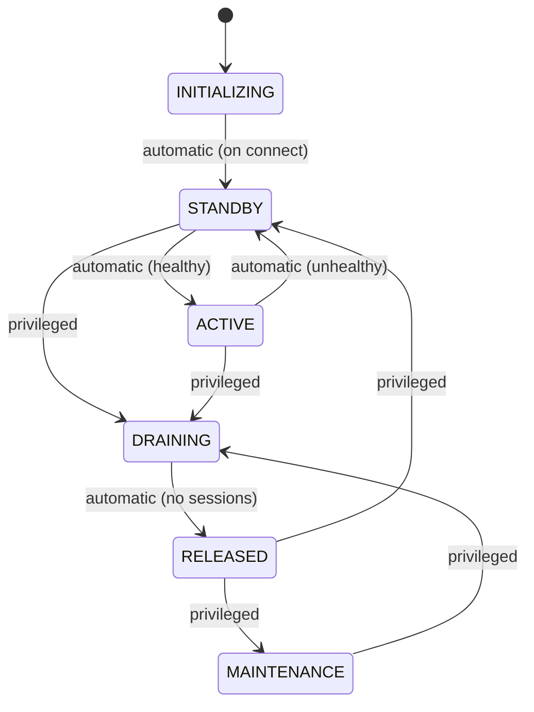

# Access control

Access to a QuEL system is organized around three ideas: your **role**, the
**session** you open to reserve resources, and the **status of each unit**.
This page explains what they mean for you as a user.

## How a system is organized

A QuEL system is coordinated by a central server that fronts one or more
**units**. You connect with [`quelware-client`](../client/index.md): the client
authenticates you, opens a session through the central server, and then talks
directly to the units to run your experiment.

## Roles

Every user is assigned one of three roles, which determines the management
operations they may perform.

| Operation                    | `NORMAL_USER` | `PRIVILEGED_USER` | `ADMIN` |
| :--------------------------- | :-----------: | :---------------: | :-----: |
| Start a session              |       ✓       |         ✓         |    ✓    |
| Change unit status           |               |         ✓         |    ✓    |
| Add / update / remove users  |               |                   |    ✓    |

Roles are managed with [`quelware-admin`](../admin/index.md).

## Capabilities within a session

Within a session, your role also grants a set of **capabilities** that gate
what you may do to the resources you have locked.

| Capability                  | `NORMAL_USER` | `PRIVILEGED_USER` | `ADMIN` |
| :-------------------------- | :-----------: | :---------------: | :-----: |
| Execute instruments         |       ✓       |         ✓         |    ✓    |
| Deploy instruments          |               |         ✓         |    ✓    |
| Force-unlock others' locks  |               |                   |    ✓    |

- **Execute instruments** — run measurement and control with already-deployed
  instruments.
- **Deploy instruments** — change instrument configuration and (re)deploy.
- **Force-unlock** — release a lock held by another session.

## Sessions and locks

To use a unit's resources you open a **session** (see
[`Session`](../client/api/session.md)). Opening a session **locks** the
requested resources so that no other session can use them, and the lock is held
under a time-to-live (TTL) lease that the client keeps renewed. Closing the
session — or letting the lease expire — releases the resources. A new session
can only be opened on a unit whose status is `ACTIVE`.

## Unit status

The central server assigns a **status** to each unit and continuously monitors
its health (whether it is linked up to the hardware and time-synchronized). The
status determines whether you can start a session on that unit.

| Status        | Meaning                                                                 | Start a session? |
| :------------ | :---------------------------------------------------------------------- | :--------------: |
| `ACTIVE`      | Healthy and available.                                                  |       Yes        |
| `STANDBY`     | Connected but not yet healthy; returns to `ACTIVE` automatically.       |        No        |
| `DRAINING`    | Being taken out of service; existing sessions continue.                 |        No        |
| `RELEASED`    | Idle, with no sessions.                                                 |        No        |
| `MAINTENANCE` | Reserved for administrator maintenance, such as time synchronization.   |        No        |
| `UNAVAILABLE` | Unreachable or in a serious error state.                                |        No        |

As a normal user you mainly care whether a unit is `ACTIVE`; the client works
with the units that are ready to use. Transitions between statuses are either
**automatic** — the central server reacts to a unit's health — or **privileged**,
driven by an administrator with
[`quelware-admin unit`](../admin/index.md) and
[`quelware-admin maintenance`](../admin/index.md).

### Lifecycle

A unit may also enter `UNAVAILABLE` from any status if a serious error occurs,
such as the unit becoming unreachable.
