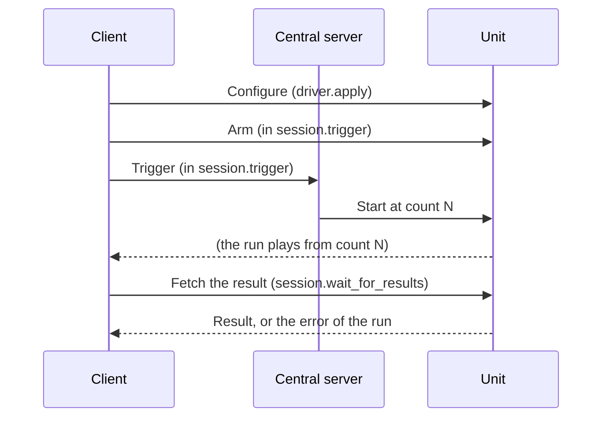

# Triggering

This page explains how a run of instruments starts, how you get its results,
and how it can fail. The [tutorial](../tutorials/fixed-timeline.md) shows the
same steps as code.

## A run, step by step

A run takes three calls:

1. **Configure** each instrument with `driver.apply()`: its frequency, its
   timeline, and so on. The unit keeps these settings; nothing plays yet.
2. **Trigger** the instruments with `session.trigger()`. The client first arms
   them, so the unit puts their settings on the device, and then asks for a
   trigger at a time a little after now. Every unit starts at that time, so
   instruments on several units start together.
3. **Wait** for the results with `session.wait_for_results()`. It returns when
   every instrument has finished, with the result of each.



```python
await driver.apply([SetFrequency(hz=6.0e9), timeline])
await session.trigger(ids)
results = await session.wait_for_results(ids, timeout_sec=10.0)
```

Pass `wait_for_results()` the same instruments you gave to `trigger()`, also
the ones that only send. An instrument without a capture window has an empty
result, but waiting for it tells you whether it played: if it failed, you get
its error instead of a capture that silently lacks a pulse.

## One run per unit, in a session

Within a session, each unit has at most one run:

- A trigger on a unit **replaces** the run before it. After you trigger
  instrument B, you can no longer wait for instrument A on the same unit,
  unless you trigger A again.
- Initializing an instrument (`session.initialize()` or `driver.initialize()`)
  **clears** the run of its unit, for every instrument on that unit. The
  instrument is left empty: armed, it plays and captures nothing until you
  give it a timeline again.
- Units are separate: a trigger on unit X keeps the run on unit Y.
- Sessions are separate: other sessions on the same unit have their own runs,
  and never replace yours.

The client keeps track of this. When you wait for an instrument that is not in
the last trigger on its unit, it raises `NotTriggeredError` at once, without
asking the unit. This also covers an instrument whose trigger failed.

A trigger and an initialize change the run of a unit, so one session must not
run two of them on the same unit at the same time. If you try, for example by
calling `trigger()` twice in parallel, the second one raises `UnitBusyError` at
once. Calls on different units can run in parallel.

!!! note

    The client keeps this record per `Session` object. If you build a second
    `Session` with the same token, it does not see the triggers of the first.

## When the trigger fires

`trigger()` takes `wait_ms`, the time from now to when the run starts. It gives
every unit time to get ready.

- With `wait_ms=None`, the default, the server chooses the wait, by how it is
  set up and by how many units the run spans.
- The server raises a wait shorter than it allows to its minimum.

A unit that is not ready when the time comes cannot start the run, and reports
an error (see below). Use the default unless you have measured that a shorter
wait works on your system;
[`quel-trigger-wait-test`](../tools/index.md#quel-trigger-wait-test) measures
it.

## When a run fails

**A unit reports an error.** For example, the unit could not start the run at
the time it was given. `wait_for_results()` waits for every instrument to
finish, then raises `RunFailedError`:

- `failures` holds the error of each instrument that failed, as the unit
  reported it.
- `results` holds the results of the others.

```python
try:
    results = await session.wait_for_results(ids, timeout_sec=10.0)
except RunFailedError as e:
    for instrument_id, error in e.failures.items():
        print(f"{instrument_id} failed: {error}")
    results = e.results
```

**The trigger itself fails.** If a unit refuses to start the run, `trigger()`
raises the unit's error. Nothing has run, so waiting for these instruments
raises `NotTriggeredError`. You can trigger them again.

**The run does not end.** `wait_for_results()` waits without limit unless you
pass `timeout_sec`. When the time runs out, it raises `TimeoutError` with the
instruments that are still running. Always pass `timeout_sec`, a little longer
than your run takes.

**You configure an instrument after its run.** Calling `driver.apply()` after a
run means the unit no longer has the result of that run, and waiting for it
fails. Wait for the results first, then configure the next run.

## Long runs and lost connections

You do not need to handle these yourself:

- A unit answers a fetch only for a limited time. When a run takes longer, the
  client asks again, until the run ends or `timeout_sec` runs out.
- Every call has a time limit, so a unit that is gone makes the call fail
  instead of hanging.
- When a connection is lost, the client retries the calls that are safe to
  make again. It does not retry the scheduling of a trigger, because a late one
  would start the run after its time.
